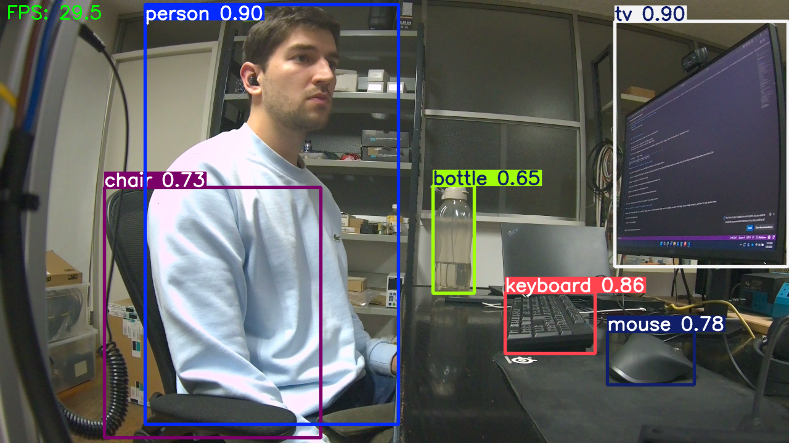

# COCO: Real-Time YOLO on NVIDIA AGX Orin



Real-time object detection optimized for the **NVIDIA Jetson AGX Orin**, focusing on a high-performance hardware-accelerated pipeline that bypasses heavy SDKs like DeepStream.

---

## Technical Stack

* **Hardware Connection:** FRAMOS FSM:GO IMX678 sensor connected via **FPA-4.A/AGX adapter** (AGX DevKit).
* **Camera Interface:** CSI via `nvarguscamerasrc` (NVIDIA Argus / ISP).
* **Inference Engine:** Ultralytics YOLOv8.
* **Backend:** TensorRT (.engine) for zero-PyTorch runtime overhead.
* **Pipeline:** GStreamer + OpenCV `appsink`.
  
---

## Features

* **Hardware ISP Integration:** Fully utilizes the Jetson Image Signal Processor for color correction, scaling, and white balance.
* **TensorRT Optimization:** FP16 quantized inference for maximum throughput on the Orin GPU.
* **Low Latency:** Optimized memory handling by offloading color conversion (NV12 -> BGRx) to hardware blocks.
* **Embedded Focus:** Designed specifically for JetPack 6.x and L4T environments.

---

## Requirements & Setup

### 1. Prerequisites
* JetPack 6.x (TensorRT 10.x+)
* Python 3.10+
* OpenCV compiled with GStreamer support

### 2. Installation
```bash
# Recommended: Use a virtual environment
python -m venv yolo
source yolo/bin/activate

# Install core dependencies
pip install ultralytics opencv-python
sudo apt install -y python3-gi gir1.2-gstreamer-1.0 gstreamer1.0-tools
```

### 3. Export YOLOv8 TensorRT Engine
From the Jetson, run the export command to build the engine optimized for the Orin's Ampere architecture:
```bash
yolo export model=yolov8n.pt format=engine imgsz=640 half=True device=0
```
**Output:** `yolov8n.engine`

**Notes:**
* First export can take a few minutes (TensorRT build).
* This uses the native TensorRT installed with JetPack.
* Missing `onnxslim` or `onnxruntime-gpu` warnings can be ignored. The engine is still built correctly.

---

## Critical Calibration: Fixing the "Pink Tint"

To get correct colors and ISP behavior, it is critical to select a specific **sensor mode**. Without this, the image often defaults to a heavy pink/reddish tint.

### The Fix: Pipeline Configuration
You must explicitly set `sensor-mode=0` and `wbmode=1` in your GStreamer string. This avoids the pink tint by triggering the correct ISP profile.

```python
pipeline_str = (
    f"nvarguscamerasrc sensor-id=0 sensor-mode=0 wbmode=1 ! " # Forces calibrated mode & AWB
    f"video/x-raw(memory:NVMM), width=1280, height=720, format=NV12 ! "
    f"nvvidconv ! video/x-raw, format=BGRx ! "             # HW color conversion
    f"videoconvert ! video/x-raw, format=BGR ! "           # Fast channel drop
    f"appsink ..."
)
```

### Important Notes about ISP and Tuning Files
On Jetson platforms:
* The ISP tuning file is loaded by the **Argus stack itself**.
* Files placed in `/var/nvidia/nvcam/settings/camera_overrides.isp` are automatically picked up by Argus.
* There is **no supported** `tuning-file` or `sensor-tuning-file` property on `nvarguscamerasrc`.

So this is expected and correct:
1. You do **not** pass the ISP file through GStreamer.
2. You only need to restart the pipeline after updating the file in the settings folder.

---

## Why TensorRT instead of .pt?

**Advantages:**
* **No PyTorch dependency at runtime:** Lighter deployment environment.
* **Lower Latency:** Optimized specifically for the target GPU.
* **Lower CPU Usage:** Offloads inference computation more effectively.
* **Deterministic Deployment:** Consistent performance across runs.

---

## Usage

Run the deployment script to start the hardware-accelerated inference:
```bash
python main.py
```
* **ESC:** Safely close the pipeline and windows.
